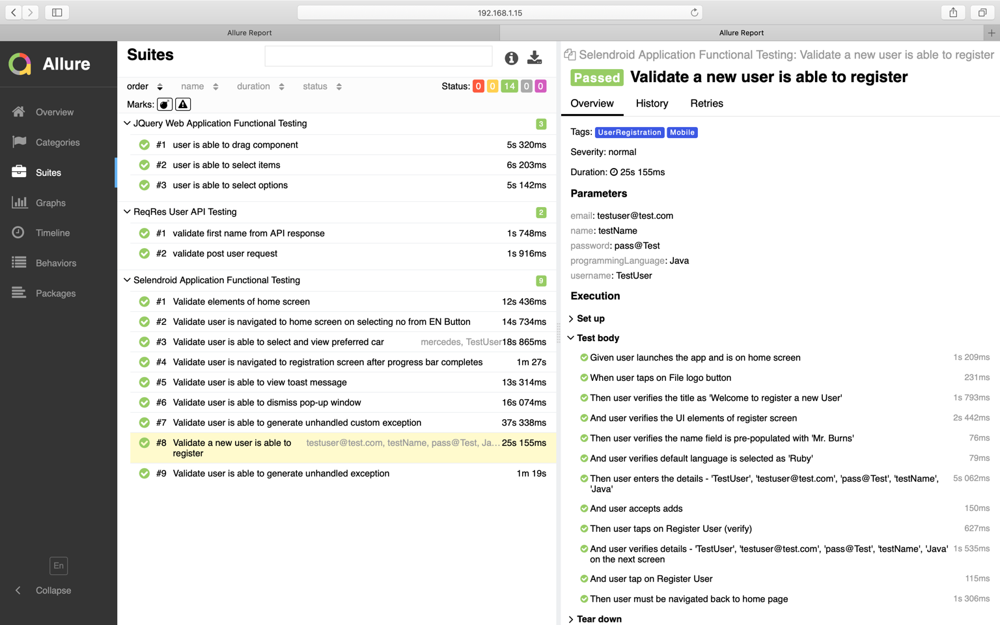

# selendroid-appium-tests
This is Java Maven based automation test framework which servers as a common solution for mobile, web and api automated tests.

**Tools**:

Automation Frameworks: Selenium, Appium, REST Assured

Testing Frameworks: TestNG, Cucumber

Design Pattern: Page Object Model

Reporting: Allure Reports

Device: Android Emulator

**Prerequisites**

* Appium installed via npm
* JDK 8
* Maven 3.8.1
* Android sdk
* Emulator
* allure

Note: All the configuration related to set-up is provided  
⇥ src-->main-->java-->resources

****Execution****

*Via Maven*:    mvn test

*Via TestNG*:   testng.xml

*Via Cucumber*:  CucumberRunner.java
* Cucumber tags - 
  * @Web: for functional web tests
  * @Mobile:  for functional mobile tests
  * @API:  for integration tests

****Reporting****

To generate allure reports commandline: 
* allure serve ${project.build.directory}/allure-results

****Snapshot of Sanity Test****

